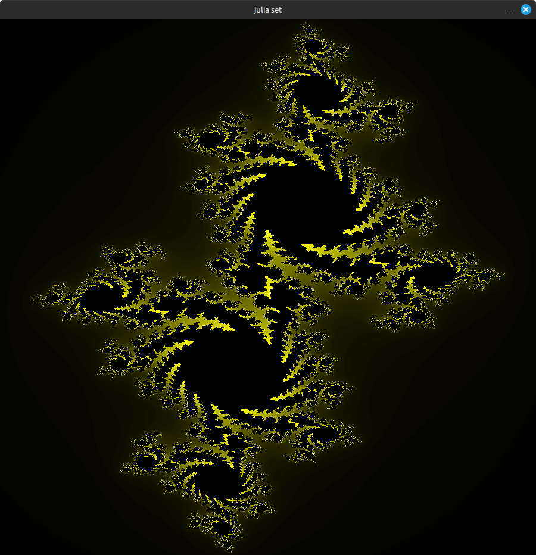
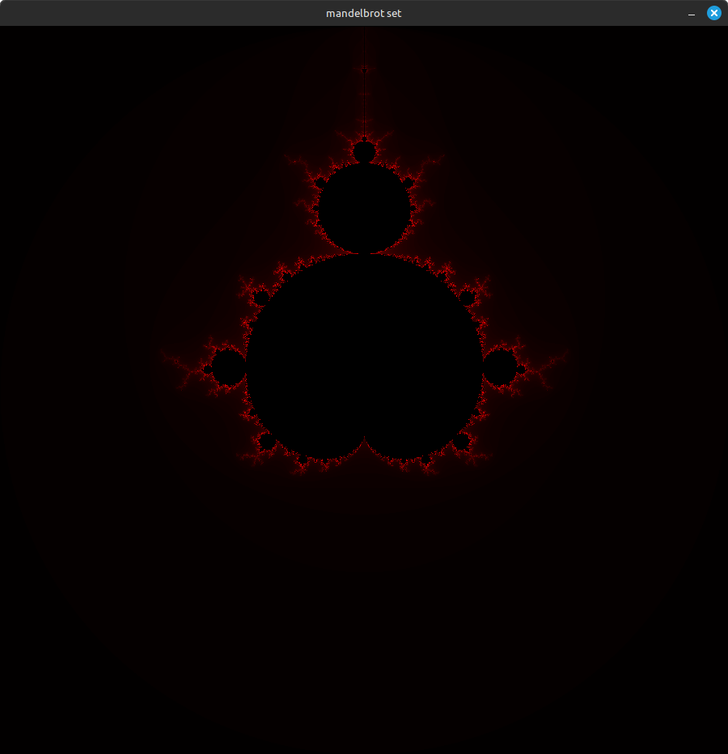
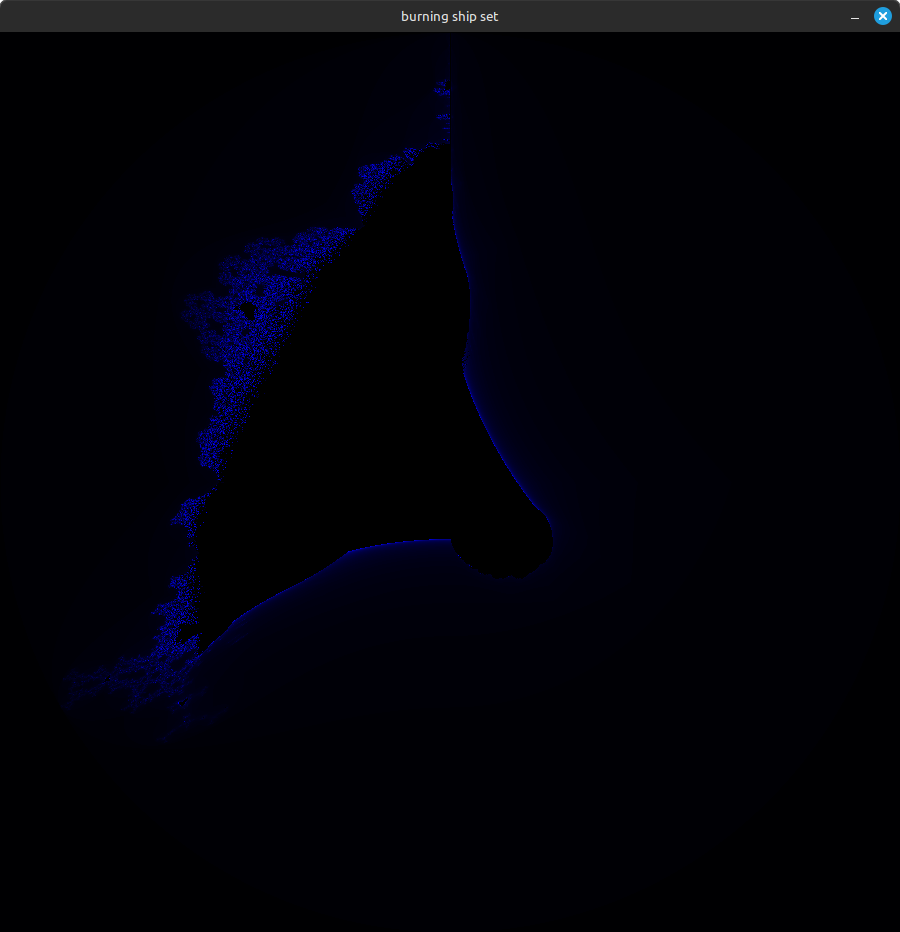

## Julia Set


## Mandelbrot Set


## Burning Ship Set



## Ressources
- Read about fractals:
  - [Fractal Wikipedia](https://en.wikipedia.org/wiki/Fractal)
  - [Mandelbrot Set Wikipedia](https://en.wikipedia.org/wiki/Mandelbrot_set)
  - [Julia Set Wikipedia](https://en.wikipedia.org/wiki/Julia_set)
  - [Burning Ship Fractal Wikipedia](https://en.wikipedia.org/wiki/Burning_Ship_fractal)

## Setup Environment
- Install miniLibX, pthread, and math libraries.
- Read about libraries:
  - **MiniLibX**: A simple graphics library for creating basic graphics without needing to know about X-Window or Cocoa. It helps you make windows, draw shapes, handle images, and manage events easily.
  
  - **X-Window**: A system that helps display graphics on Unix computers, allowing programs to show images and windows.

  - **Installation**:
    ```bash
    sudo apt-get update && sudo apt-get install xorg libxext-dev zlib1g-dev libbsd-dev
    ```
  - Download MiniLibX:
    ```bash
    git clone https://github.com/42Paris/minilibx-linux.git mlx_linux
    cd mlx_linux
    make
    ./configure
    make
    ```
  - Create a Makefile in your main project to compile the source code.

- **pthread**: Typically included with the system libraries, include `pthread.h` in your code.


